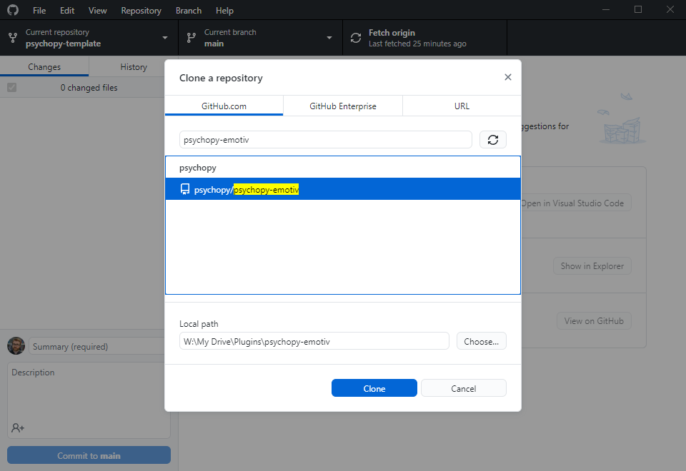
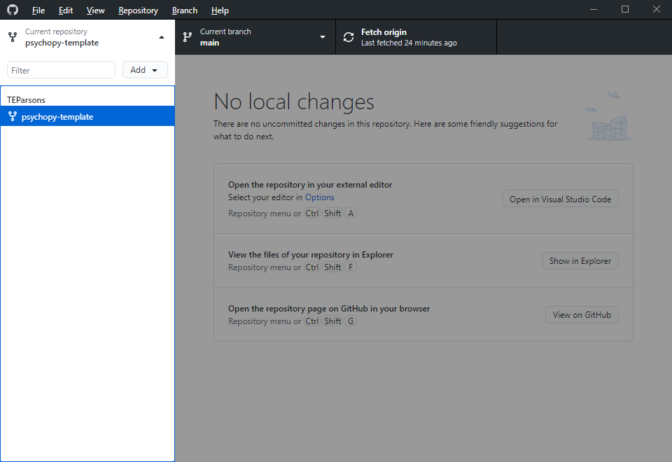

# How to edit plugin docs

As plugins live in entirely separate GitHub repos from PsychoPy, so do their documentation. This guide shows you how to create/edit documentation for a plugin.

## Cloning the plugin

Before editing, you'll need to get the plugin repo "cloned" to your local files. Here's how you do that:

1. Open [GitHub Desktop](https://desktop.github.com/)
2. Go to File -> Clone repository...
   
3. Search for the name of the plugin and choose a local folder to sync it to (I recommend having a folder called Plugins to keep all of your cloned plugin repos together)
   
4. Click "Clone", GitHub Desktop will copy all the files to the folder you specified and keep track of any changes you make to them.

## Creating new documentation

If a plugin doesn't have any existing documentation, here's how to add some:

1) Using the steps above, clone the repo called `TEParsons/psychopy-template` to your Plugins folder. Once done, the `psychopy-template` folder should look like this:
   
2) Do the same for the plugin you want to add docs to (let's call this the "target plugin")
3) Copy the `docs` and `.github` folders from `psychopy-template` to the local folder for the target plugin. From here on in we won't touch `psychopy-template` - so assume any changes from here on are in the target plugin's local repo!
4) Update `conf.py` to use the details from the target plugin (e.g. replace `repo = 'https://github.com/TEParsons/psychopy-template'` with a link to the target plugin's GitHub repo)
5) For each sub-module (`.py` file in the root of the plugin module, or folder with an `__init__.py` file) of the target plugin, create a copy of `template_module.rst`, then make the following changes:
   1) Change the filename of the new file to be the same as the file/folder name of the sub-module
   2) Replacing the page's title with the name of the sub-module
   3) Replace `psychopy_template.template_module` (after `.. automodule:: `) with a path to the module, as if you were importing it in Python (check how the `template_package` folder is structured in `psychopy-template` for an example)
6) For each component / standalone routine in the target plugin, create a copy of `TemplatePluginComponent.rst`, then (either manually or through the function `createComponentDocs` in `utils.py`) replace the filename and content with relevant content from the component / routine in the target plugin
7) Update the title and text in `index.rst` to reflect the target plugin
8) If the target plugin contains any components / routines, replace `TemplatePluginComponent` with the filenames of the `.rst` files you added for these. Otherwise, delete the whole section, from `.. toctree::` to `TemplatePluginComponent`.
9) Do the same for `template_module` and any `.rst` files you added for modules within the target plugin

## Editing existing documentation

If the plugin you want to edit already has docs, then you can find these in the `docs` folder of the local repo created when you clone it. There should be an `.rst` file for each component, routine and module included in the plugin. See above for info on how to add a new file, otherwise you can edit these text files in whatever text editor you prefer (Notepad, [Sublime Text](https://www.sublimetext.com/), [VS Code](https://code.visualstudio.com/), even [PyCharm](https://www.jetbrains.com/pycharm/)!)

> Top tip: In most advanced text editors, you can open an entire folder as a "project", letting you switch between files via a handy sidebar tool rather than having to go back and forth with Windows Explorer / Mac Finder.

## Syncing changes

Once you've pulled down a plugin repo, you can select it in the "Current repository" section of GitHub Desktop:

With the plugin you're editing as the current repository, any changes you made to the docs files (remember to save!) should appear in the Changes menu. To sync these, just add a Summary (commit message), click "Commit to main" and then click "Sync" in the top bar.

You may not have access to the plugin repo, in which case you'll need to create a fork. GitHub will prompt you to do this, if you say yes then it will create a fork of the main branch in your own user space. Once created, you can submit your changes as a pull request like so:

1. Go to [GitHub](github.com)

2. Go to the repo of the plugin you were editing

3. Select the "Pull Requests" tab from the top bar and click "New pull request" (in the top right):
   

4. There should be a message under the header saying:

   > Choose two branches to see what’s changed or to start a new pull request. If you need to, you can also compare across forks.

   Click the text "compare across forks"

5. Use the "head repository" drop down to choose your fork of the plugin repo (it will be `YourGitHubUsername/plugin-name`)

6. Once selected, you should see the commit(s) you submitted listed below. If you're happy with the changes, click "Submit pull request"

7. The maintainer of the plugin is now able to pull in your changes!